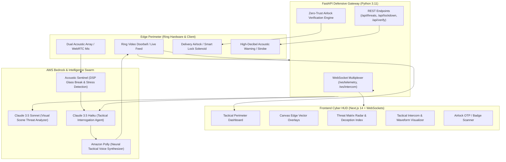

# Ring Cerberus - Architecture & Technical Specification

> **Track**: Ring Track (Build, Ship, Shape: Amazon Developer Hackathon) + AWS Builder & Open Source Mini Challenges.  
> **Mission**: Autonomous Defensive Swarm & Zero-Trust Perimeter Lockdown for intelligent front-door defense.

---

## 1. High-Level Architecture Overview

Ring Cerberus transforms standard Ring video doorbell hardware into a distributed, zero-trust autonomous perimeter defense nexus. It couples edge vision overlays with an AWS Bedrock dual-model agentic swarm (Claude 3.5 Sonnet for multi-frame deep scene analysis & Claude 3.5 Haiku for rapid conversational interrogation) alongside an acoustic sentinel and an automated delivery airlock.

---

## 2. Core Subsystems

### 2.1 Multi-Agent Bedrock Defensive Swarm
1. **Scene Assessor (`Claude 3.5 Sonnet`)**:
   - Ingests high-resolution keyframes from Ring Video streams.
   - Detects concealed weapons, crowbars, lockpicks, balaclavas, aggressive posture, and deceptive delivery gear (e.g. fake courier uniforms).
   - Generates normalized bounding box coordinates `[ymin, xmin, ymax, xmax]` and confidence metrics.
2. **Dynamic Interrogator (`Claude 3.5 Haiku`)**:
   - Sub-second latency agent.
   - Initiates contextual voice interrogations (e.g. *"Courier: State the 6-digit one-time airlock authorization pin or deposit the parcel outside the primary gate"*).
   - Monitors response latency, vocal hesitation, and transcript anomalies to compute the **Deception Index** ($0.0 \rightarrow 1.0$).
3. **Tactical Voice Synthesizer (`Amazon Polly`)**:
   - Converts tactical de-escalation directives into clear, authoritative synthesized voice prompts delivered via two-way intercom.

### 2.2 Acoustic Sentinel
- Analyzes microphone audio streams using sliding-window spectrogram analysis.
- Flags frequency-specific acoustic anomalies:
  - **Glass Fracturing**: $3.5\text{ kHz} - 6.5\text{ kHz}$ resonant impulse spikes.
  - **Forced Entry / Heavy Impact**: Sub-$150\text{ Hz}$ high-amplitude transients.
  - **Human Distress / Screams**: $1.2\text{ kHz} - 3.2\text{ kHz}$ sustained vocal formant patterns.

### 2.3 Zero-Trust Airlock
- Replaces naive "leave at door" protocols with time-synchronized cryptographic TOTP authentication.
- Couriers or visitors enter an ephemeral token or scan a QR badge.
- Valid tokens trigger transient relay release (15-second secure parcel hatch deposit).
- Invalid tokens after 2 attempts trigger automatic camera zoom, threat status elevation to `ALERT`, and strobe illumination.

---

## 3. Communication Protocols
- **Telemetry WebSocket (`/ws/telemetry`)**: Broadcasts real-time JSON frames at 10-20 Hz containing detected target bounding vectors, audio dB levels, threat scores, and status flags.
- **Intercom WebSocket (`/ws/intercom`)**: Full-duplex audio stream pipe connecting the client operator and automated AI agent with the Ring speaker/mic hardware.
